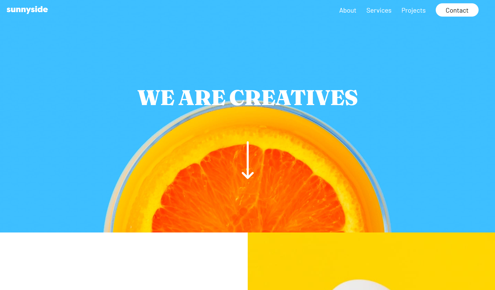

<h1 align="center">Sunnyside Agency Landing Page</h1>

challenge from <a href="https://www.frontendmentor.io">Frontend Mentor</a>

<h2 align="center"><a href="https://saem843.github.io/Sunnyside-Agency-LP/">🚀Live Site</a>||<a href="./README-jp.md">🇯🇵日本語のREADMEはこちら</h2></a>

This is an agency landing page. For mobile size, the nav bar turns to be a hamburger button

## 💡Key Features

User should be able to:

- View the optimal layout for the site depending on their device's screen size
- See hover states for all interactive elements on the page

## ⚒️Built with

- HTML
- CSS
- JavaScript
